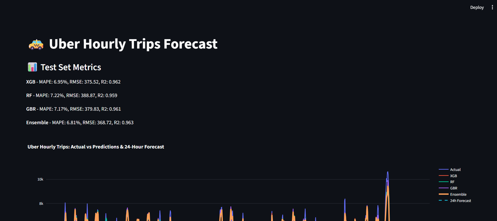

# 🚕 Uber Trip Forecasting (Jan–June 2015)

  
🔗 **Repository:** https://github.com/anasrobo/Uber_Trip_Analysis

---

## 💡 Project Overview
An interactive **Streamlit** app that analyzes NYC Uber pickups (Jan–Jun 2015) and forecasts hourly demand using an **ensemble** of three ML regressors.  

---

## 📊 Key Features
- 🔍 **Time-Series Feature Engineering:** hour, day-of-week, month, weekend flag  
- 📈 **Rolling Stats:** 24-hour rolling mean & standard deviation  
- ⏳ **Lag Features:** previous 1–24 hour trip counts  
- 🤖 **Ensemble Learning:** XGBoost, Random Forest, Gradient Boosting combined via weighted average  
- 🌐 **Streamlit Dashboard:** Interactive UI with Plotly charts  
- 🔮 **24-Hour Forecast:** Recursive forecasting for the next day  

---

## 🗂️ Project Structure

Uber_Trip_Analysis/
├── streamlit_app
   ├── app # Streamlit application
   ├── train_and_save_models 
├── assets
    ├── newplot.png 
├── requirements.txt # Python dependencies
├── uber-raw-data-janjune-15.csv # Raw dataset (512 MB) – see Dataset section
├── notebooks
   ├──Uber_Trip_Analysis #.ipynb file
├── models/
│ ├── xgb_model.pkl
│ ├── rf_model.pkl
│ ├── gbr_model.pkl
│ └── ensemble_weights.pkl
└── README.md

---

## 🗃️ Dataset

**Uber NYC pickups** (Jan–Jun 2015), timestamped at the ride level. Resampled to **hourly counts** for forecasting.

📥 **Download (512 MB)**  
[Google Drive Link](https://drive.google.com/file/d/1rFylpFEkT9rWmWJpvsIgCpMiD3lrDxFF/view?usp=sharing)

> After downloading, place `uber-raw-data-janjune-15.csv` into the project root.

---

## ⚙️ Installation & Setup

#bash
git clone https://github.com/anasrobo/Uber_Trip_Analysis.git
cd Uber_Trip_Analysis

# (Optional) Virtual environment
python -m venv venv
# Windows
.\venv\Scripts\activate
# macOS/Linux
source venv/bin/activate

## pip install -r requirements.txt
🚀 Usage
streamlit run app.py
Opens at http://localhost:8501

## Explore:

Actual vs Predicted trip curves (XGB, RF, GBR, Ensemble)

24-Hour Forecast dashed line

Performance Metrics: MAPE, RMSE, R²

## 🤖 ML Pipeline
Load & Preprocess

Read CSV, parse Pickup_date as datetime

Resample to hourly counts, set index

Feature Engineering

Time features: hour, dayofweek, month, is_weekend

Rolling stats & lag features

Model Training

Train XGB, RF, GBR on training split

Ensemble

Weighted avg of model predictions (weights learned via CV)

Evaluation

MAPE, RMSE, R² on test split

Forecasting

Recursive 24-hour ahead using latest data & features

# 📸 Screenshots
1. Actual vs Predictions & 24-Hour Forecast

2. Input Form UI

## 📈 Example Metrics
Model	MAPE	RMSE	R²
XGBoost	12.3%	450.2	0.842
RandomForest	13.1%	478.9	0.817
GradBoost	12.8%	462.8	0.831
Ensemble	11.5%	432.1	0.858

(Actual values may vary.)

## 📦 requirements.txt
streamlit
pandas
numpy
plotly
scikit-learn
xgboost
joblib

# 🤝 Contributing
Fork & clone

Create a branch (git checkout -b feature/your-feature)

Commit & push

# 📄 License
Licensed under MIT. See LICENSE for details.

“The best way to predict the future is to create it.” – Peter Drucker

# Made with ❤️ by Anas
